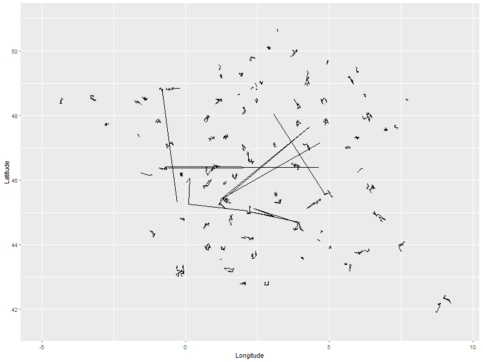
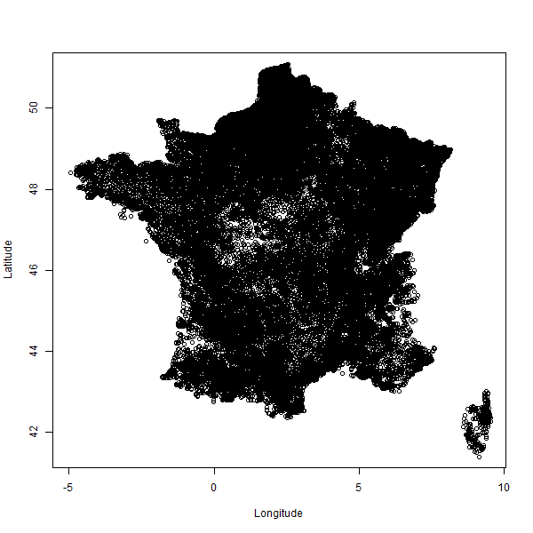
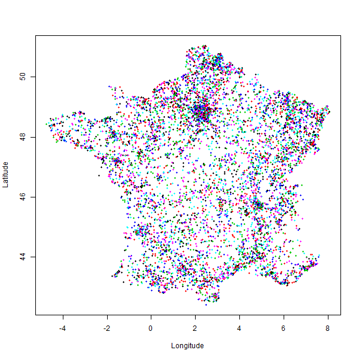

## Etude de l'impact de la taille des circonscriptions, et d'autres paramètres du scrutin, sur le résultat des élections législatives 2017

L'étude se focalise sur la façon dont les circonscriptions influencent la composition de l'assemblée Nationale. Le mode de scrutin utilisé dans cette élection est le scrutin uninominal majoritaire à deux tours, par circonscription. C'est un mode de scrutin assez particulier et l'influence du paramètre de la circonscription est rarement débattue. Le paradigme de ce mode de scrutin, à la fois fondamental et implicite, est que le représentativité de la population française n'est assurée que par l'hétérogénéité spatiale des opinions politiques dans le pays; c'est-à-dire que si la population était répartie de façon homogène sur le terriroire (disons, aléatoirement), **alors il n'y aurait qu'un seul parti politique à l'Assemblée Nationale**. En effet, on sait que si on échantillonne 1000 personnes au hasard dans la population, les opinions politiques sont celles de l'ensemble du pays à 1 ou 2 pourcent près. Il n'y a donc a priori pas de raison pour que deux circonscriptions au hasard, qui comptent 80000 électeurs, aient des résultats différents. 

De fait, on voit bien que la taille des circonscriptions est un paramètre majeur, qui découle en fait du nombre de députés (577). On comprend facilement que plus les circonscriptions sont grandes, plus l'homogénéité politique sera forte. A l'extrême, l'élection présidentielle fonctionne comme une élection législative à une seule circonscription qui fait toute la France. Et il n'y a bien qu'un seul parti politique représenté à l'Elysée :-)

Si on veut étudier ce paramètre, il faut se libérer de la contrainte du nombre de députés fixe à *577*. Pour simuler des circonscriptions bien réelles de taille croissante (en commençant en bas de l'échelle par le bureau de vote), il est nécessaire de parvenir à les agréger entre elles de façon hiérarchique, par un **algorithme de clustering** basé sur la distance, mais fonctionnant à taille de cluster constante (ou quasi-constante). C'est là la grande difficulté de ce projet, car un tel algorithme est par défaut sous-spécifié. Une des contraintes est d'agréger des bureaux de vote proches, en conservant des tailles d'ensemble homogènes. 

Plusieurs approches ont été testées, l'approche retenue finalement étant celle du voyageur de commerce. Quelques exemples de résultats:

Une [appli shiny a été réalisée](https://agenis.shinyapps.io/democracie/) pour permettre à l'utilisateur de "rejouer" l'élection en paramétrant le mode de scrutin à sa guise.

Le rapport complet est le fichier "note.de.synthese.pdf"

Clustering TSP pour la france entière, splittée par département:

Agrégation hiérarchique par un facteur 4 des clusters TSP successifs:

Un autre type de clutering (non choisi): clustering spatial de dirichlet:

## Licence

Le code est sous licence GNU

## Auteur

marc.agenis@gmail.com
